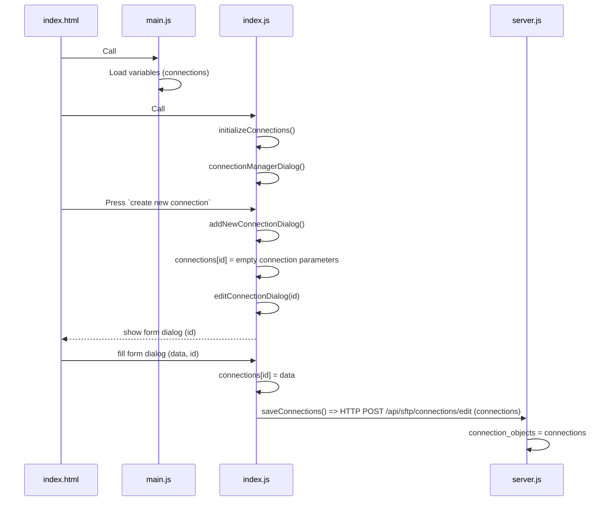

# sftp-browser

To run the server:
```shell
npm run startserver
```

## Changes

-   Instead of storing connections in the client browser, these are now stored in the server
    -   On window load (`index.js`, `window.addEventListener('load', ...)`) get the stored connections

```js
if (Object.keys(connections).length === 0) {
	console.log("Connections not loaded yet, waiting...");
	await initializeConnections();
}
```

## Server objects
- `credentials` - A key-value object that maps an id to the credentials of a session.
    - **KEY** *(UUID)* - A random UUID.
    - **VALUE** *(Object)* - An object that contains the credentials:
        - `id` *(UUID)* - The same UUID of the key.
        - `name` *(string)* - The name of the connection. This is used only in the web UI, so it's not included in the actual SFTP connection.
        - `host` *(string)* - The hostname for the connection.
        - `port` *(number)* - The port for the connection. If not provided, the default is 22.
        - `username` *(string)* - The username for the connection.
        - `path` *(string)* - The starting path where the connection starts.
        - `createdTime` *(number)* - The timestamp in milliseconds of the created time.
        - One of these authentication methods, if nothing is passed, a JSON 400 error will be thrown:
            - `password` *(string)* - The password for the connection.
            - `key` *(string)* - The SSH key for the connection.

- `sessions` - A key-value object that maps session hashes to SFTP session objects.
    - **KEY** *(string)* - The hash of the SFTP connection options. These options are: 
        - The host;
        - The port;
        - The username;
        - The password;
        - The SSH key;
    - **VALUE** *(sftp)* - The SFTP connection object that enables the browser to work.

- `sessionActivity` - A key-value object that maps session hashes to the last activity timestamp.
    - **KEY** *(string)* - See the *key* of `sessions`.
    - **VALUE** *(number)* - The timestamp in milliseconds of the last recorded activity of the session.

- `sessionCredentials` - A key-value object that maps session hashes to their corresponding credentials.
    - **KEY** *(string)* - See the *key* of `sessions`.
    - **VALUE** *(number)* - See the *value* of `credentials`.


### A possible rework in a single object

The name could be `sessionManager`.

- **KEY** *(string)* - The hash of the SFTP connection options. These options are: 
    - The host;
    - The port;
    - The username;
    - The password (can be undefined);
    - The SSH key (can be undefined);
- **VALUE** *(Object)* - A unified object:
    - `credentials` *(Object)* - An object that contains the credentials: 
        - `id` *(UUID)* - A secondary key with a random UUID. Should be used for the creation/retrival process for credentials.
        - `name` *(string)* - The name of the connection. This is used only in the web UI, so it's not included in the actual SFTP connection.
        - `host` *(string)* - The hostname for the connection.
        - `port` *(number)* - The port for the connection. If not provided, the default is 22.
        - `username` *(string)* - The username for the connection.
        - `path` *(string)* - The starting path where the connection starts.
        - `createdTime` *(number)* - The timestamp in milliseconds of the created time.
        - One of these authentication methods, if nothing is passed, a JSON 400 error will be thrown:
            - `password` *(string)* - The password for the connection.
            - `key` *(string)* - The SSH key for the connection.
    - `session` *(sftp)* - The SFTP connection object that enables the browser to work.
    - `lastActivity` *(number)* - The timestamp in milliseconds of the last recorded activity of the session.


## Flow

### No connections stored
