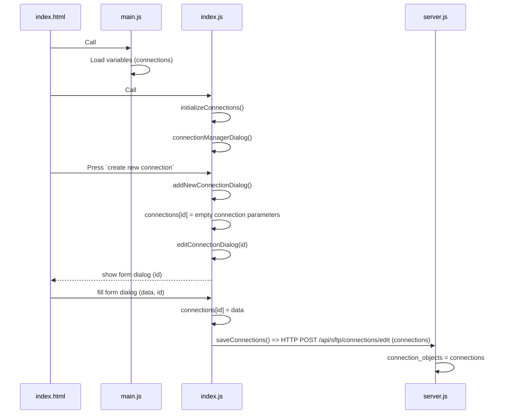

# sftp-browser

To run the server:
```shell
npm run startserver
```

## Changes

-   Instead of storing connections in the client browser, these are now stored in the server
    -   On window load (`index.js`, `window.addEventListener('load', ...)`) get the stored connections

```js
if (Object.keys(connections).length === 0) {
	console.log("Connections not loaded yet, waiting...");
	await initializeConnections();
}
```

## Flow

### No connections stored
